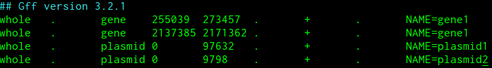

############
Using docker
############

.. _link_to_meee:

------------
Installation
------------

First, if not already installed, install docker community edition, following the instructions found `here <https://www.docker.com/get-started>`_.

Check the installation was correct, either in the terminal, or PowerShell for windows::

    docker --version

Clone the repository into an appropriate location, or download and unzip the file. In the terminal or PowerShell change directory into the new minotourapp directory.::

    cd /path/to/minotourapp/

Build and run the docker containers. There is a helpful script that will do this for you. In UNIX environments (linux or mac) run::

    sudo ./docker-config.sh

On windows, run::

    ./docker-config.bat

Once this script has finished running, minotour should be up and accessible from localhost:10000.

--------------------------------
Create an administration account
--------------------------------

First to create a user with administrator rights::

    docker ps -a

This will show you all the containers you have installed. Copy the container ID for the web-minotour container. Run::

    docker exec -it <Container ID> python3 manage.py createsuperuser

Follow the prompts, filling in Username, Email and Password.

---------------------------------------
Add references for mapping/metagenomics
---------------------------------------

Now, in order to add references to the docker container for mapping and metagenomics it is necessary to add the reference fasta files into the celery-worker container.

To do this, run the following commands::

    docker ps -a

Copy the container ID for the celery-worker-minotour-instance container. Run::

    docker cp /path/to/folder/containing/reference/files/. <Container ID>:/var/lib/minotour/data

Now to add references to the worker application itself::

    docker exec <Container ID> python3 manage.py add_references /var/lib/minotour/data

------------------------
Add the centrifuge index
------------------------

To add the centrifuge index, you will need to have the files locally to copy across into the celery-worker-minotour-instance container.::

    docker cp /path/to/folder/containing/index/files/. <Container ID>:/var/lib/minotour/data

---------------------------------------
Add the validation regions
---------------------------------------

Validation regions must be created as GFF3 files, following the universal format found `here <http://gmod.org/wiki/GFF3>`_. An example file looks like

Finally, to add a set of validation regions::

    docker ps -a

Copy the container ID for the celery-worker-minotour-instance container. Then run::

    docker cp /path/to/folder/containing/gff/files/. <Container ID>:/var/lib/minotour/data

And to add them to the application::

    docker exec <Container ID> python3 manage.py add_validation_sets -S <desired_set_name> -k <api_key> /var/lib/minotour/data

The api key can be found on the profile section of a logged in account on the minotour page, under the drop down of the username in the top nav bar.
