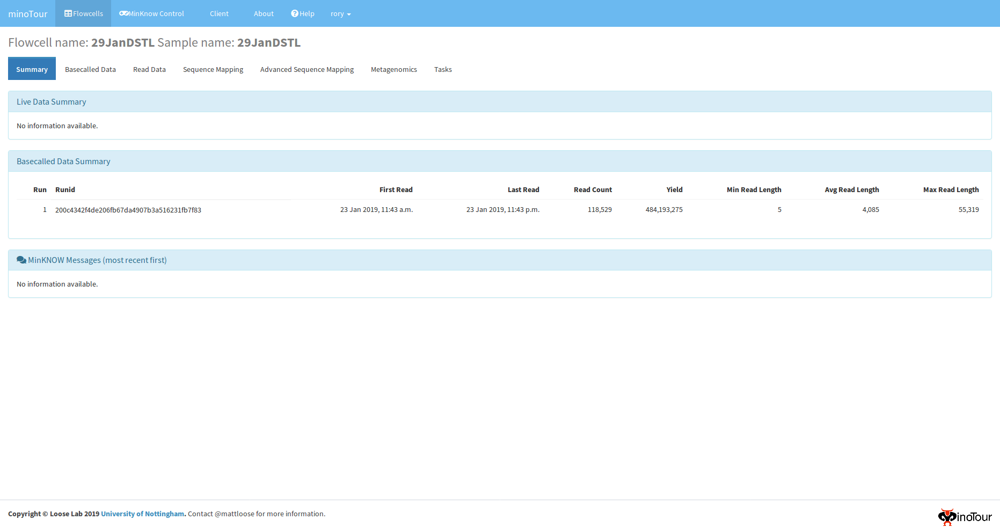
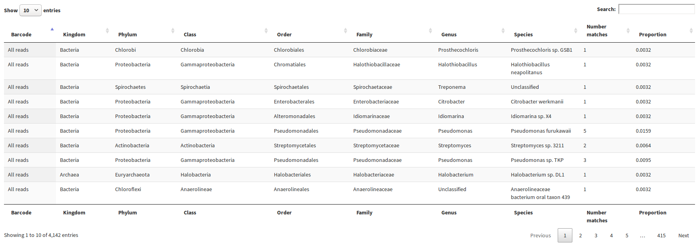

#####################
Threat agent analysis
#####################

To start a target analysis from the client it is first necessary to add the references to the minotour web app. This is covered whilst setting up docker here - :doc:`docker`

The -j flags and -ts flags on the minotour client, minFQ, can be used to automatically start a job upon flowcell creation.

We recommend using a config file, as covered in the client setup instructions :doc: minfq.

In this config file, set::

    key=<api_key>
    port=10000
    hostname=127.0.0.1
    ip-address=127.0.0.1
    job=Metagenomics
    targets=<Target_set_name>

To see which jobs, references and validation sets are available to you, after setup of the client ( can be found here -:doc:`minfq`) ::

    source myenv/bin/activate
    minFQ --list.

Run the client upload, minFQ -n <Flowcell_name> -w /path/to/fastq/directory.

--------------------------------------
Start the analysis in the minotour app
--------------------------------------

It is possible to start the task in the minotour app, by navigating into the view of the desired flowcell, switching to the tabs task and selecting the Metagenomics task.

If a target set is not selected from the second drop down, no mapping will take place, and only Centrifuge based results will be shown.

----------------
Analysis results
----------------

Navigate to the minoTour page in the browser - http://localhost:10000

Either a login page will appear, or the flowcell page will appear with a list of all the flowcell showing that have been uploaded to minoTour.

Select the flowcell that you have started uploading, which will have the name you provided in the minFQ command.

This will take you to the flowcell summary page. There will be several tabs selections visible. If there is no Metagenomics tab, this may mean that the first iteration of the analysis has yet to finish. Don't worry, data will come.

Once it has appeared, select the Metagenomics tab. This will take you to a page like the one below.

.. image:: _static/Metagenomics.png

The table here shows the results of your threat agent analysis. Red indicates a presence, Green indicates that the species has yet to be found in that sample.

By clicking the expand data button, extra data about the Threat agents is shown in more visualisations, such as the number of mapping reads, whether they map to target regions.

.. image:: _static/Extra_data.png

Information is also displayed about the Centrifuge classification analysis of the whole sample, with the top 10 species for each taxonomic rank displayed.

And a searchable, sortable table of all the findings.

